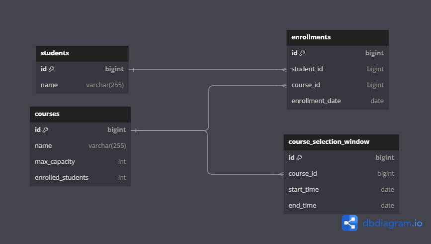

# Course Enrollment System

## Описание
Course Enrollment System — это веб-приложение на основе Spring Boot, предназначенное для управления записями студентов на курсы в университете. Приложение позволяет добавлять студентов, создавать курсы, управлять окнами записи и отслеживать количество записанных студентов.

---

## Функционал
- Регистрация студентов
- Создание и управление курсами
- Запись студентов на курсы в рамках открытых окон записи
- Отображение информации о курсах и записях студентов

---

## Технологии
- Java 21
- Spring Boot 3.3.2
- H2 Database
- Maven
- Lombok
- JUnit 5

---

## ER-диаграмма

## Эндпоинты

### 1. Запись студента на курс
- **Метод**: `POST`
- **URL**: `/api/courses/enroll`
- **Параметры**:
    - `studentId` (Long, обязательный): ID студента.
    - `courseId` (Long, обязательный): ID курса.
- **Описание**: Записывает студента на указанный курс.
- **Ответы**:
    - `200 OK`: Успех. Ответ: `"Student enrolled successfully"`
    - `400 Bad Request`: Ошибка, если нет мест или студент уже записан на курс или окно на запись уже закрыто.
    - `404 Not Found`: Ошибка, если курс или студент не найдены.

---

### 2. Получение списка всех курсов
- **Метод**: `GET`
- **URL**: `/api/courses/status`
- **Описание**: Получает список всех курсов.
- **Ответ**:
    - `200 OK`: Возвращает список курсов в формате JSON.

---

### 3. Получение информации о курсе
- **Метод**: `GET`
- **URL**: `/api/courses/{courseId}`
- **Параметры**:
    - `courseId` (Long, обязательный): ID курса.
- **Описание**: Получает информацию о конкретном курсе по его ID.
- **Ответы**:
    - `200 OK`: Возвращает информацию о курсе в формате JSON.
    - `404 Not Found`: Ошибка, если курс не найден.
